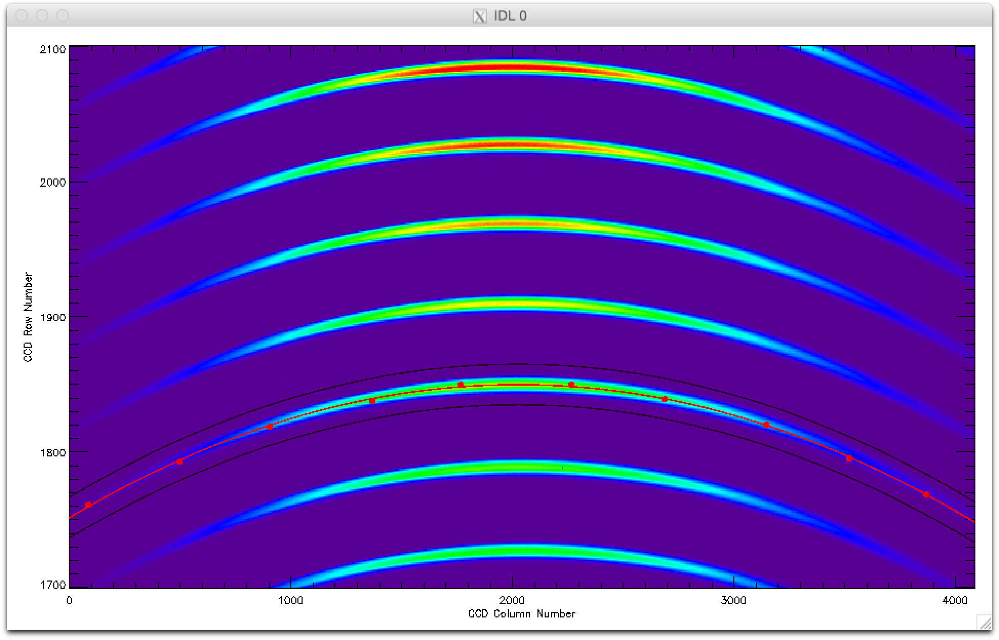
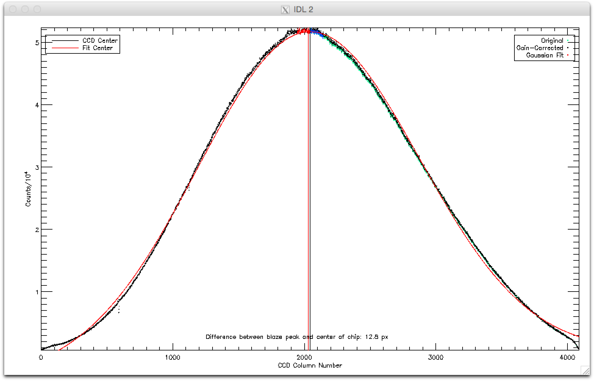
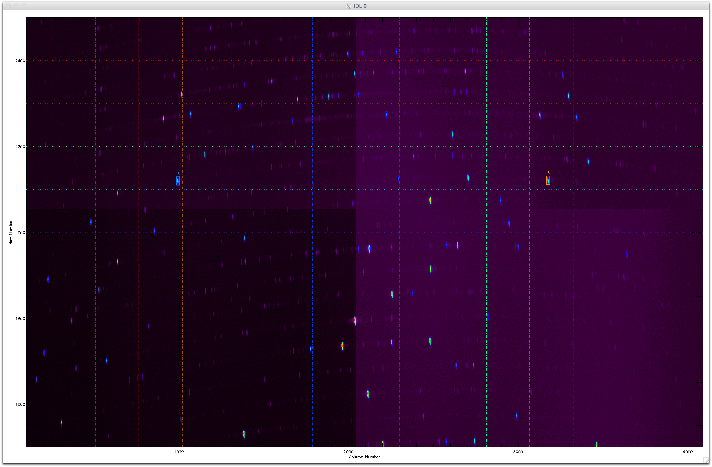
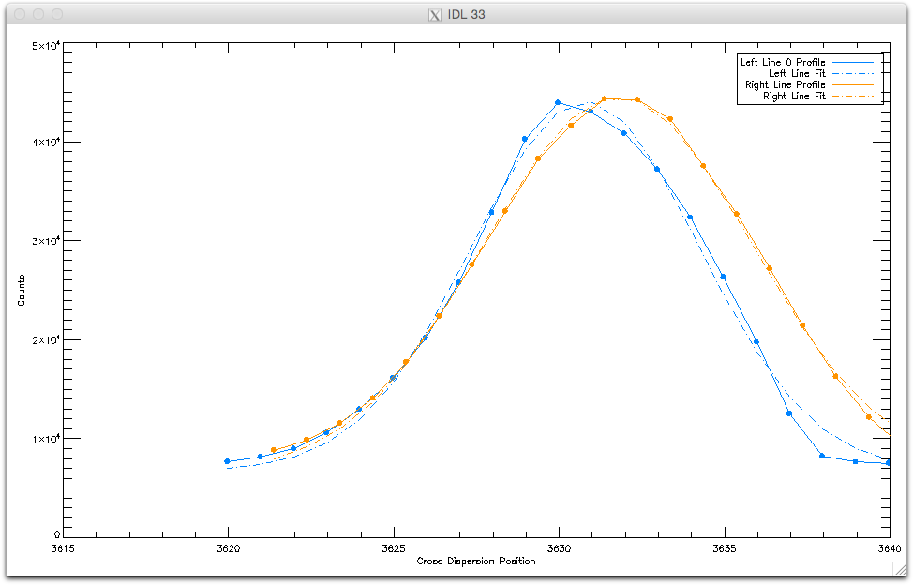
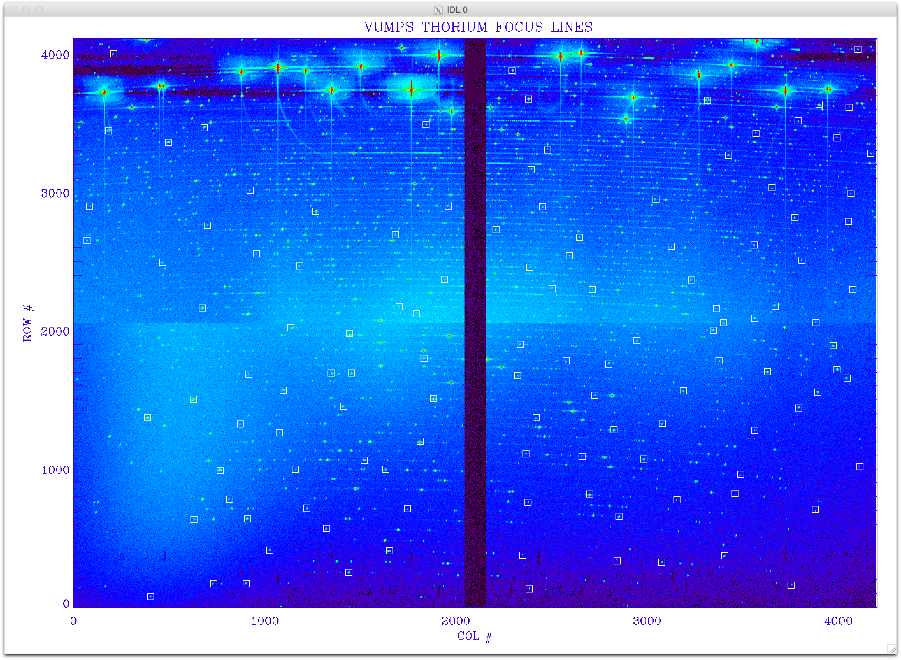
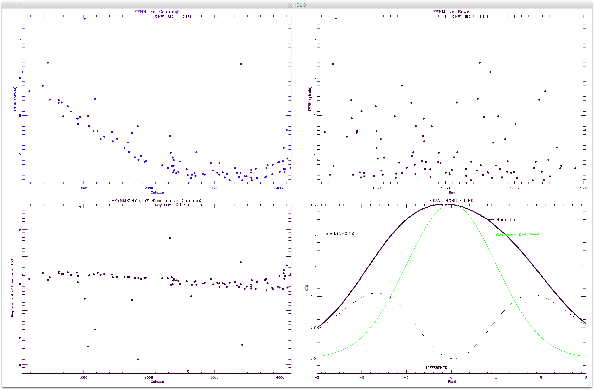

=============
COMMISSIONING
=============

**A repo for commissioning the VUMPS Spectrometer**

This repository contains code used for the commissioning of VUMPS.

Dependencies
============

Both the `reduction code`_ and commissioning code are written in the IDL_
programming language, and they are both dependent on the following
libraries:

1. The built-in IDL_ library
2. The IDLAstro_ package
3. The idlutils_ package
4. The MPFIT_ package
5. The coyote_ library

.. _`reduction code`: https://github.com/VUMPS/REDUCTION
.. _IDL: http://www.exelisvis.com/ProductsServices/IDL.aspx
.. _IDLAstro: https://github.com/mattgiguere/IDLAstro
.. _idlutils: https://github.com/mattgiguere/idlutils
.. _MPFIT: https://www.physics.wisc.edu/~craigm/idl/fitting.html
.. _coyote: http://www.idlcoyote.com/documents/programs.php

---------------
Getting Started
---------------

Install the dependencies
------------------------

::

    cd ~/projects
    git clone https://github.com/mattgiguere/IDLAstro.git
    git clone https://github.com/mattgiguere/idlutils.git
    wget https://www.physics.wisc.edu/~craigm/idl/down/mpfit.tar.gz
    mkdir mpfit; tar -xvf mpfit.tar.gz -C mpfit
    wget http://www.idlcoyote.com/programs/zip_files/coyoteprograms.zip
    unzip coyoteprograms.zip -d .

Update the startup script
-------------------------

Included in this repository is a convenience script, ``vumpsc.sh``,
that sets up the environment for the commissioning code. Once the
dependencies described above are installed, update `vumpsc.sh` with
the appropriate path information, and then start the script from
the command line. This will correctly set the IDL path and startup
IDL in the ``VUMPS/COMMISSIONING/code`` directory:

::

    cd ~/projects/VUMPS/COMMISSIONING
    ./vumpsc.sh
    Now setting the path to +/Users/matt/projects/VUMPS/COMMISSIONING/code:+/Users/matt/projects/idlutils:+/Users/matt/projects/IDLAstro/pro:+/Applications/exelis/idl/lib
    Now changing the directory to: /Users/matt/projects/VUMPS/COMMISSIONING/code
    IDL Version 8.2.2, Mac OS X (darwin x86_64 m64). (c) 2012, Exelis Visual Information Solutions, Inc.
    IDL> pwd
    % Compiled module: PWD.
    /Users/matt/projects/VUMPS/COMMISSIONING/code

------------------------
Commissioning Procedures
------------------------

This section describes several routines included in this package and
shows examples of how to use them and their output.

Centering the Blaze Peak
-------------------------

Positioning the peak of the Blaze function at the center of the chip
will ensure that the full free spectral range is on chip. The routine
``find_blaze_center.pro`` can help with this task.

To use ``find_blaze_center``, take an unsaturated quartz exposure in
any resolution mode. Next, startup of the vumps commissioning
environment and pass in the filename of the quartz exposure as
a keyword argument:

::

    find_blaze_center, fname='/raw/vumps/150522/vumps150522.1234.fit', /vumps

This will display the middle section (i.e. green orders) and prompt
the user to click ten times across the order to roughly mark the
order location.

The code will then perform the following tasks:

1. fit a polynomial to the marked order locations
2. extract the counts in a swath that extends a few pixels above and
   below the order
3. sum the counts in the cross-dispersion direction
4. perform a rough gain adjustment
5. fit a gaussian to the summed counts
6. plot the results and print out the offset between the mean of the
   fitted gaussian and the center of the chip

To slightly improve the result the user can use the optional keyword
arguments ``bfname`` to input a bias frame, and ``chop_order_wings``
to exclude the pixels towards the edge of the chip::

    find_blaze_center, fname='/raw/vumps/150524/vumps150524.1155.fit', $
    bfname = '/raw/vumps/150524/vumps150524.1047.fit', $
    chop_order_wings = 400, /vumps

On mao1, the commands are

::

    cd /data/tous/projects/VUMPS/COMMISSIONING
    ./vumpsc.sh
    find_blaze_center, fname='/data/raw/vumps/150524/vumps150524.1155.fit', $
    bfname = '/data/raw/vumps/150524/vumps150524.1047.fit', $
    chop_order_wings = 400, /vumps

The resulting plot should look something like the figure below.

Rotating the CCD
----------------

The next step is to rotate the CCD. This step positions the cross-
dispersion direction of the spectrograph in the columnar direction
on the CCD, allowing the orders to be integrated in the cross-
dispersion direction during extraction without a loss of resolution.

The ``rotate_ccd`` routine assists with CCD rotation. To use it, pass
in a ThAr image using the filename keyword argument:

::

    rotate_ccd, filename='/raw/vumps/150524/vumps150524.1034.fit', /vumps

``rotate_ccd`` also allows for the optional subtraction of a bias frame:

::

    rotate_ccd, filename='/raw/vumps/150524/vumps150524.1034.fit', $
    /vumps, /includebias, $
    biasfn = '/raw/vumps/150524/vumps150524.1047.fit'

And an example of running this routine on mao1 is

::

    rotate_ccd, filename='/data/raw/vumps/150524/vumps150524.1034.fit', /vumps

``rotate_ccd`` will then display the ThAr image and prompt the user to
select a single ThAr line that is in two adjacent orders and is
approximately equidistant from the center of the chip. ``rotate_ccd``
superimposes lines to assist with line identification, and the lines
of the same color are equidistant from the center of the chip.

Below is an image showing the result after clicking the line.

``rotate_ccd`` then integrates the line in the dispersion direction,
and fits a gaussian to determine the line center.

Ideally, there should be no difference in the line center positions
between the two lines. However, this whole process is approximate
(e.g., the lines are only approximately equidistant from the
center of the chip in the x-direction, and the order we are looking
at is only approximately at the center of the chip in the y-direction).

In the above example ``rotate_ccd`` printed out that the fitted
difference in line centers between the two clicked lines was only
1.4 pixels, which is an excellent position.

Focus and Tilt
----------------

Lastly, we want the CCD to be in the focal plane, and we want the
instrument to be in focus. If the CCD is not in the focal plane,
then only a fraction of the CCD can be in focus for any given position.
``foc.pro`` assists with both the tilt and focus tasks.

``foc.pro`` takes a ThAr image as input. It then calculates the FWHM
for every line within a user-generated mask and creates plots showing
the FWHM as a function of row, column, and also prints the average
FWHM for all the lines.

The first run with ``foc.pro`` will require a mask to be generated
identifying regions that have isolated ThAr lines. Generate this
mask using the ``findloc`` optional keyword argument:

::

    foc, /plt, /mark, /findloc, $
    inpfile='/data/raw/vumps/150524/vumps150524.1034.fit'

This will display the ThAr image and prompt you to enter the number
of lines you would like to include in the mask. The more the better ---
try for at least 120, and when identifying the lines, try to cover
the entire chip evenly. Below is an image showing the locations
of the 120 lines used during the initial commissioning at Yale.

If the ``plt`` optional keyword is specified, ``foc.pro`` will then
display the gaussian fit to every single line in the mask. Finally,
it will show the FWHM as a function of CCD row and column, and some
other plots.

``foc.pro`` automatically saves the line list as ``lines.found`` in
the code directory. To use ``foc.pro`` in the future without having
to click on all the lines again, copy lines.found to
``vumps_lines.found``.

To execute ``foc.pro`` using the saved line list

::

  foc, /plt, $
  inpfile='/data/raw/vumps/150524/vumps150524.1034.fit'
